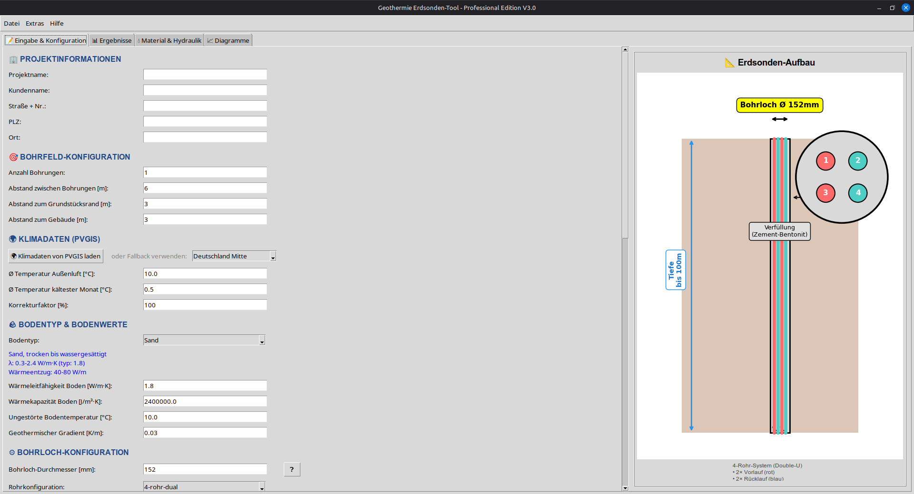

<div align="center">
  
  
  # GET - Geothermie Erdsonden Tool
  
  **GET** steht für **G**eothermie **E**rdsonden**T**ool
</div>

[](https://opensource.org/licenses/MIT)
[](https://www.python.org/downloads/)
[](https://github.com/3ddruck12/Geothermie-Erdsonden-Tool/actions)
[](https://github.com/3ddruck12/Geothermie-Erdsonden-Tool/releases)


> **Open-Source Tool zur professionellen Berechnung von Erdwärmesonden bis 100m Tiefe**

**GET** ist eine moderne, benutzerfreundliche Open-Source-Alternative zu kommerziellen Erdwärmesonden-Berechnungsprogrammen für Linux und Windows.

---

## 📋 Inhaltsverzeichnis

- [Systemanforderungen](#-systemanforderungen)
- [Features](#-features)
- [GET Cloud ☁️](#-get-cloud-)
- [Installation](#-installation)
- [Schnellstart](#-schnellstart)
- [Dokumentation](#-dokumentation)
- [Screenshots](#-screenshots)
- [Mitwirken](#-mitwirken)
- [Lizenz](#-lizenz)

---

## 💻 Systemanforderungen

### Unterstützte Betriebssysteme

#### Windows
- ✅ Windows 11 (alle Versionen)
- ✅ Windows 10 (alle Versionen)

#### Linux
- ✅ Ubuntu 20.04 LTS oder neuer
- ✅ Ubuntu 22.04 LTS
- ✅ Ubuntu 24.04 LTS
- ✅ Linux Mint 20.x oder neuer
- ✅ Linux Mint 21.x
- ✅ Debian 11 (Bullseye) oder neuer
- ✅ Debian 12 (Bookworm)

### Mindestanforderungen
- **Python**: 3.12 oder höher (bei Python-Installation)
- **RAM**: 4 GB (empfohlen: 8 GB)
- **Festplatte**: 250 MB freier Speicherplatz
- **Display**: 1280x720 oder höher

---

## ✨ Features

### 🆕 Neu in V3.4.0-beta3 (Februar 2026)
- 📡 **Langzeit-Simulation** (bis 25 Jahre, Cloud: 50): Temporal Superposition nach Eskilson (1987)
- ♻️ **Regenerations-Analyse**: Thermische Balance, Auskühlung-Warnung, optimaler Heiz/Kühl-Anteil
- ⚡ **Saisonale Effizienz (SCOP/SEER/JAZ)**: Temperatur- und teillastabhängiger COP, Jahresarbeitszahl
- 📊 **4 neue Langzeit-Diagramme** (gesamt 17): Temperaturentwicklung, Thermische Balance, monatlicher COP, JAZ-Vergleich
- 🔧 **g-Funktions-Fix**: Finite Line Source läuft korrekt gegen ICS-Grenzwert
- ✅ **129 pytest Unit-Tests** (alle grün)

### Neu in V3.4.0-beta2.2 (Februar 2026)
- 🏗️ **Architektur-Refactoring**: God-Class aufgelöst (4648 → 3353 Zeilen)
  - 6 Tab-Module: `InputTab`, `ResultsTab`, `MaterialsTab`, `DiagramsTab`, `BorefieldTab`, `LoadProfilesTab`
  - 2 Controller: `CalculationController`, `FileController`
- 📊 **Monatliche Lastprofile**: Neuer Tab mit 12×3 Tabelle, Vorlagen (EFH, MFH, Büro, Gewerbe)
- 🚿 **Warmwasser (VDI 2067)**: 800 kWh/Person/Jahr, monatliche Verteilung
- 📈 **Lastprofil-Diagramme**: Balken- und Liniendiagramm, Export PNG/PDF
- 📊 **Monatliche Entzugsleistung (W/m)**: Zeitreihe im Lastprofile-Tab und Diagramme-Tab
- 🧹 **Legacy entfernt**: V1/V2 GUI gelöscht, Import-Fallback-Kette entfernt
- ✅ **115 pytest Unit-Tests** (inkl. 20 Lastprofil-Tests)
- 🔄 **CI/CD**: GitHub Actions pytest-Integration

### Neu in V3.3.6.1 (Februar 2026)
- 🗺️ **Interaktive OSM-Karte**: OpenStreetMap-Karte im Eingabe-Tab mit Marker-Platzierung per Rechtsklick
- 📄 **Lageplan in Bohranzeige-PDF**: Automatischer OSM-Lageplan mit Standort-Marker und Koordinaten
- 🔄 **Auto-Übernahme Projektdaten**: Eingabe-Tab → Bohranzeige beim Tab-Wechsel (Kunde, Adresse, Koordinaten)
- 📍 **Karten-Synchronisation**: PVGIS-Geocoding aktualisiert automatisch die Karte und Bohranzeige-Koordinaten

### 🆕 Neu in V3.3.6 (Februar 2026)
- 📄 **Wasserrechtliche Bohranzeige (§ 49 WHG)**: Neuer Tab mit komplettem Formular für die Untere Wasserbehörde
- 📋 **PDF-Export**: Behördengerechtes A4-Formular mit Antragsteller, Grundstück, Technik, Gewässerschutz
- ⬇️ **Technische Daten aus Berechnung**: Ein-Klick-Übernahme aller 17 technischen Parameter
- 💾 **Speichern in .get-Datei**: Bohranzeige-Daten werden im Projektformat mitgespeichert

### 🆕 Neu in V3.3.5 (Februar 2026)
- 🔥 **Input-Validierung**: Zentrales Validierungsmodul mit Wertebereichen für ~30 physikalische Parameter
- 🔥 **Erweiterte Pumpen-Datenbank**: Grundfos Alpha3, Wilo Stratos PICO, KSB EtaLine, Lowara ECOCIRC
- 🔥 **Erweiterte Rohrkonfigurationen**: DN40, DN50, Coaxial-Rohre
- 🔥 **12 Diagramme**: Hydraulik, Wärmepumpe, Energie – mit PDF-Integration
- 🛡️ **Bugfixes**: Division-durch-Null in Hydraulik, Debug-Modus deaktiviert, robustere Fehlerbehandlung
- 🏗️ **Code-Qualität**: Logging-Framework, benannte Konstanten, erweiterte Modul-Exports

### 🆕 Neu in V3.2.1 (Januar 2026)
- 🔥 **Maximale Sondenlänge**: Automatische Anpassung der Bohrungsanzahl bei VDI 4640
- 🔥 **Gesamtlänge der Leitungen**: Anzeige für beide Berechnungsmethoden

### 🆕 Neu in V3.2.0 (Januar 2026)
- 🔥 **VDI 4640 Berechnungsmethode**: Normkonforme Auslegung nach Koenigsdorff
- 🔥 **Dominante Kühllast**: Automatische Erkennung und separate Auslegung
- 🔥 **Wärmepumpenaustrittstemperatur**: Detaillierte Temperaturkomponenten
- 🔥 **Drei Zeitskalen**: Grundlast (10 Jahre), Periodisch (1 Monat), Peak (6 Stunden)
- 🔥 **`.get` Dateiformat**: Natives Projektformat mit Versionierung
- 🔥 **Import/Export**: Speichern und Laden kompletter Projekte (Strg+S / Strg+O)
- 🔥 **pygfunction Integration**: Bohrfeld-Simulationen mit g-Funktionen
- 🔥 **Abwärtskompatibilität**: Automatische Migration von V3.0/3.1 Dateien

---

## ☁️ GET Cloud – Die Zukunft von GET

Neben der Open-Source Desktop-App planen wir **GET Cloud**, ein modernes Web-Service-Angebot für professionelle Anwender. 

**Vorteile der Cloud-Version:**
- 🔒 **SaaS-Features**: Zugriff von überall ohne Installation
- 🔒 **Hersteller-Datenbanken**: Reale Wärmepumpen-Kennlinien (Viessmann, Vaillant, etc.)
- 🔒 **Wirtschaftlichkeit**: Umfassende Amortisations-Analysen & Angebots-PDFs
- 🔒 **GEG/BEG-Check**: Automatische Prüfung der Förderfähigkeit und Norm-Compliance
- 🔒 **Team-Collaboration**: Projekte gemeinsam bearbeiten und in der Cloud speichern
- 🔒 **GET IoT**: Intelligente Dokumentationsunterstützung und Datenintegration direkt vor Ort

> [!TIP]
> Der Berechnungskern bleibt **Open Source (MIT)** und wird weiterhin parallel für die Desktop-App entwickelt. Die Cloud-Version bietet professionelle Mehrwert-Services auf dieser Basis. Zusätzlich bauen wir eine **Community-Geodatenbank** auf, um die Vorhersagequalität für alle Nutzer zu steigern.

Details findest du in der [aktuellen Roadmap](docs/ROADMAP.md#️-get-cloud--open-core-saas).

---

## 🔧 Berechnungen
- ✅ **Zwei Berechnungsmethoden**:
  - **Iterativ**: Eskilson/Hellström (klassisch)
  - **VDI 4640**: Koenigsdorff-Methode (normkonform)
- ✅ **Dominante Kühllast**: Automatische Erkennung
- ✅ **Erdwärmesonden bis 100m Tiefe**
- ✅ **Multiple Konfigurationen**: Single-U, Double-U, 4-Rohr-Systeme
- ✅ **PE 100 RC Rohre**: 32mm mit Dual- und 4-Verbinder
- ✅ **Thermische Widerstände**: Multipole-Methode nach Hellström
- ✅ **G-Funktionen**: Nach Eskilson & pygfunction
- ✅ **Hydraulik-Berechnungen**: Druckverlust, Pumpenleistung, Pumpenauswahl
- ✅ **Multi-Bohrfeld**: Mehrere Bohrungen mit Abstandsberechnung
- ✅ **Input-Validierung**: Zentrale Prüfung aller Eingabeparameter mit Wertebereichen

### 🌍 Datenbanken
- ✅ **Bodendatenbank**: 11 Bodentypen nach VDI 4640
  - Sand, Lehm, Schluff, Ton, Kies
  - Festgestein: Granit, Gneis, Basalt, Sandstein, Kalkstein
- ✅ **Verfüllmaterial-Datenbank**: 7 Materialien
  - Von Standard-Bentonit bis Hochleistungs-Graphit
- ✅ **Rohr-Datenbank**: Laden aus `pipe.txt` oder EED-Dateien

### 🌐 Klimadaten & Karten
- ✅ **PVGIS-Integration**: Automatischer Abruf von EU-Klimadaten
- ✅ **Temperaturschätzung**: Bodentemperatur aus Lufttemperatur
- ✅ **Geocoding**: Koordinaten aus Adresse
- ✅ **OSM-Karte**: Interaktive OpenStreetMap-Karte im Eingabe-Tab
- ✅ **Lageplan**: Automatischer Kartenausschnitt in Bohranzeige-PDF

### 📊 Ausgabe & Export
- ✅ **PDF-Berichte**: Professionelle Berichte mit allen Berechnungen
- ✅ **Grafische Darstellung**: Bohrloch-Schema, Temperaturverläufe
- ✅ **Projektdaten**: Kunde, Adresse, Bohrfeld-Konfiguration
- ✅ **Materialberechnung**: Benötigte Verfüllmenge

### 💡 Benutzerfreundlichkeit
- ✅ **Info-Buttons**: Hilfe zu jedem Parameter
- ✅ **Dropdown-Auswahl**: Schnelle Wahl von Boden & Material
- ✅ **Auto-Vervollständigung**: Werte aus Datenbank
- ✅ **Moderne GUI**: Tkinter mit Tabs und Scrolling
- ✅ **Cross-Platform**: Linux & Windows

---

## 💾 Installation

### Windows (10/11)

**Option 1: Standalone EXE** (empfohlen)

1. [Neueste Release herunterladen](https://github.com/3ddruck12/Geothermie-Erdsonden-Tool/releases)
2. `GeothermieErdsondentool.exe` herunterladen
3. Doppelklick zum Starten
4. Falls Windows Defender warnt: "Weitere Informationen" → "Trotzdem ausführen"

**Option 2: Python**

```powershell
git clone https://github.com/3ddruck12/Geothermie-Erdsonden-Tool.git
cd Geothermie-Erdsonden-Tool
python -m venv venv
venv\Scripts\activate
pip install -r requirements.txt
python main.py
```

### Linux (Ubuntu/Debian/Linux Mint)

**Option 1: DEB-Paket** (empfohlen für Ubuntu, Debian, Linux Mint)

```bash
# Neueste Version herunterladen
wget https://github.com/3ddruck12/Geothermie-Erdsonden-Tool/releases/download/v3.4.0-beta3/geothermie-erdsondentool_3.4.0-beta3_amd64.deb

# Installieren/Upgraden (keine Deinstallation nötig)
sudo dpkg -i geothermie-erdsondentool_3.4.0-beta3_amd64.deb
sudo apt-get install -f  # Falls Abhängigkeiten fehlen

# Starten
geothermie-erdsondentool

# Oder über das Anwendungsmenü: "GET - Geothermie Erdsondentool"
```

**Option 2: AppImage** (universell – funktioniert auf allen Linux-Distributionen)

```bash
# Herunterladen
wget https://github.com/3ddruck12/Geothermie-Erdsonden-Tool/releases/download/v3.4.0-beta3/GeothermieErdsondentool-3.4.0-beta3-x86_64.AppImage

# Ausführbar machen & starten
chmod +x GeothermieErdsondentool-3.4.0-beta3-x86_64.AppImage
./GeothermieErdsondentool-3.4.0-beta3-x86_64.AppImage
```

> **Startet nicht? (Ubuntu 22.04+, Linux Mint 21+, Debian 12+)**
> AppImages benötigen FUSE2. Einmalig installieren:
> ```bash
> sudo apt install libfuse2t64   # Ubuntu 24.04 / Linux Mint 22
> sudo apt install libfuse2      # Ubuntu 22.04 / Linux Mint 21
> ```

**Option 3: Shell-Script**

```bash
git clone https://github.com/3ddruck12/Geothermie-Erdsonden-Tool.git
cd Geothermie-Erdsonden-Tool
./start.sh
```

**Option 3: Python**

```bash
git clone https://github.com/3ddruck12/Geothermie-Erdsonden-Tool.git
cd Geothermie-Erdsonden-Tool
python3 -m venv venv
source venv/bin/activate
pip install -r requirements.txt
python main.py
```

---

## 🚀 Schnellstart

### 1. Projekt anlegen

```
📝 Projektdaten:
- Projektname: "Einfamilienhaus Müller"
- Kunde: "Familie Müller"
- Adresse: "Musterstraße 1, 12345 Musterstadt"
```

### 2. Projekt speichern (NEU in V3.2)

```
💾 Speichern:
- Menü: Datei → Als .get speichern (Strg+S)
- Später laden: Datei → .get Projekt laden (Strg+O)
- Format: JSON-basiert, menschenlesbar
```

### 3. Bohrfeld konfigurieren

```
🏗️ Bohrfeld:
- Anzahl Bohrungen: 2
- Abstand zwischen Bohrungen: 6 m
- Abstand zum Grundstück: 3 m
- Abstand zum Gebäude: 3 m
```

### 4. Bodentyp wählen

```
🌍 Boden:
- Dropdown: "Sand" → λ = 1.8 W/m·K automatisch gesetzt
```

### 5. Verfüllmaterial wählen

```
🏗️ Verfüllung:
- Dropdown: "Zement-Bentonit verbessert" → λ = 1.3 W/m·K
```

### 6. Heizlast eingeben

```
🔥 Heizlast:
- Jahres-Heizenergie: 12000 kWh
- Heiz-Spitzenlast: 6 kW
- Wärmepumpen-COP: 4.0
```

### 6. Berechnen & PDF erstellen

```
🚀 Berechnung starten
📄 PDF-Bericht erstellen
```

---

## 📚 Dokumentation

Vollständige Dokumentation im [`docs/`](docs/) Ordner:

- [📘 Installationsanleitung](docs/INSTALL.md)
- [📗 Benutzerhandbuch](docs/ANLEITUNG.md)
- [📙 Schnellstart](docs/SCHNELLSTART.md)
- [📈 Roadmap](docs/ROADMAP.md) - Geplante Features
- [📕 Changelog](docs/CHANGELOG.md)
- [📓 Version 2 Features](docs/NEUE_FEATURES_V2.md)
- [📔 Version 3 Features](docs/PROFESSIONAL_FEATURES_V3.md)

### Technische Dokumentation

- **Thermische Berechnung**: Multipole-Methode nach Hellström
- **G-Funktionen**: Eskilson's dimensionless temperature response
- **VDI 4640**: Bodenwerte nach deutscher Norm
- **PVGIS API**: EU Joint Research Centre Klimadaten

---

## 🖼️ Screenshots

### Hauptfenster - Eingabe & Visualisierung

<div align="center">
  
  
  *Moderne Benutzeroberfläche mit 2-Spalten-Layout: Eingaben links, Visualisierung rechts*
</div>

### Features im Screenshot
- ✅ **Links**: Eingabeformular mit Dropdown-Auswahl (Boden, Verfüllmaterial)
- ✅ **Rechts**: Statische Erdsonden-Grafik mit 4 Leitungen & Querschnitt
- ✅ **Info-Buttons**: Hilfe zu jedem Parameter mit Fragezeichen-Symbol
- ✅ **Tabs**: Übersichtliche Organisation (Eingabe, Berechnung, Visualisierung)
- ✅ **Einheiten**: Alle Werte in praxisgerechten Einheiten (mm, kWh)

### PDF-Bericht
- 📄 Professionelle Berichte mit Projektdaten
- 📊 Detaillierte Berechnungsergebnisse
- 📈 Grafiken und Temperaturverläufe
- 🏗️ Verfüllmaterial-Berechnung (m³, Liter, Kosten)
- 💧 Hydraulik-Analyse (Druckverlust, Pumpenleistung)

---

## 🤝 Mitwirken

Beiträge sind willkommen! 

**Für Entwickler:**
- 📖 [Beitragsrichtlinien](docs/CONTRIBUTING.md) - Code-Style, Workflow
- 🔄 [Git-Workflow](docs/GIT_WORKFLOW.md) - Branch-Strategie, CI/CD
- 📈 [Roadmap](docs/ROADMAP.md) - Geplante Features

**Quick Start:**
```bash
git clone https://github.com/3ddruck12/Geothermie-Erdsonden-Tool.git
cd Geothermie-Erdsonden-Tool
python3 -m venv venv
source venv/bin/activate
pip install -r requirements.txt
python main.py
```

Siehe [CONTRIBUTING.md](docs/CONTRIBUTING.md) für Details.

---

## 📝 Lizenz

Dieses Projekt ist unter der MIT-Lizenz lizenziert - siehe [LICENSE](LICENSE) für Details.

---

## 🙏 Danksagungen

- **Prof. Dr.-Ing. Roland Koenigsdorff**: VDI 4640 Berechnungsmethode und wissenschaftliche Grundlagen
- **Dr. Massimo Cimmino**: [pygfunction](https://github.com/MassimoCimmino/pygfunction) - Hervorragende g-Funktionen Library
- **VDI 4640**: Bodenwerte und Berechnungsstandards
- **PVGIS**: EU-Klimadatenbank  
- **Wissenschaftliche Community**: Für Forschung und Methodik im Bereich Geothermie
- **Python Community**: Für die großartigen Libraries

---

## 📧 Kontakt

- **GitHub**: [3ddruck12](https://github.com/3ddruck12)
- **Issues**: [GitHub Issues](https://github.com/3ddruck12/Geothermie-Erdsonden-Tool/issues)

---

## ⭐ Support

Wenn dir dieses Projekt gefällt, gib ihm einen **Star** ⭐ auf GitHub oder unterstützt meine arbeit mit einer kleinen Spende!

[](https://ko-fi.com/E1E61RRPU8)

**Made with ❤️ for the geothermal community**
