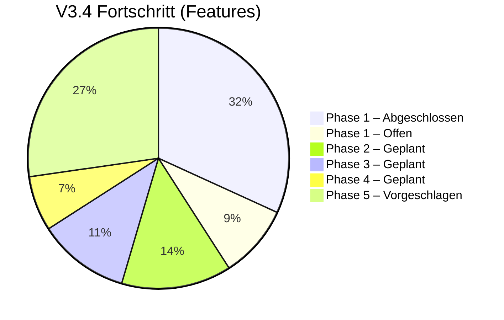

# 🔍 GET V3.4 – Feature-Audit & Roadmap-Erweiterung

> **Stand**: 17. Februar 2026 | **Version**: 3.4.0-beta1

---

## ✅ Phase 1 – Architektur-Refactoring (ABGESCHLOSSEN)

| Feature | Status | Nachweis |
|---------|:------:|----------|
| **God-Class aufgelöst** (4.648 → 3.353 Zeilen) | ✅ | `main_window_v3_professional.py` refaktorisiert |
| `gui/tabs/input_tab.py` – Eingabefelder | ✅ | 31 KB, 12 Sektionen + Event-Handler |
| `gui/tabs/results_tab.py` – Ergebnis-Anzeige | ✅ | 1,6 KB |
| `gui/tabs/diagrams_tab.py` – 12 Matplotlib-Diagramme | ✅ | 39 KB, alle Plot-Funktionen |
| `gui/tabs/materials_tab.py` – Verfüllmaterial/Rohre/Fluide | ✅ | 7,8 KB |
| `gui/tabs/borefield_tab.py` – Bohrfeld-Simulation | ✅ | 11,9 KB, g-Funktionen |
| `gui/controllers/calculation_controller.py` | ✅ | 41 KB, Berechnungssteuerung |
| `gui/controllers/file_controller.py` | ✅ | 25,7 KB, Import/Export |
| **Legacy-GUIs entfernt** (V1 + V2) | ✅ | `main_window.py` und `main_window_extended.py` gelöscht |
| **71 Unit-Tests (pytest)** | ✅ | 4 Test-Module |
| └─ `test_thermal.py` – 16 Tests | ✅ | Thermische Widerstände |
| └─ `test_hydraulics.py` – 24 Tests | ✅ | Druckverlust, Reynolds |
| └─ `test_borehole.py` – 10 Tests | ✅ | Iterative Berechnung |
| └─ `test_validators.py` – 21 Tests | ✅ | Input-Validierung |
| **CI/CD-Pipeline** (GitHub Actions) | ✅ | `test.yml`: pytest auf Ubuntu + Windows |

### Phase 1 – Noch offen

| Feature | Status | Priorität |
|---------|:------:|:---------:|
| Input-Validierung in GUI einbinden | ⬜ | Hoch |
| Normen-Compliance-Check (VDI 4640 Grenzen) | ⬜ | Mittel |
| Auto-Save (alle 5 Min.) | ⬜ | Niedrig |
| i18n-Infrastruktur (`gettext`) | ⬜ | Niedrig |

---

## ⬜ Phase 2 – Monatliche Lastprofile (GEPLANT)

| Feature | Status |
|---------|:------:|
| 12×3 Eingabetabelle (Monat / Heizlast / Kühllast) | ⬜ |
| Schnelleingabe: Jahreswert → Monate | ⬜ |
| Vorlagen (EFH, MFH, Büro, Gewerbe) | ⬜ |
| Warmwasser-Lastprofil (VDI 2067) | ⬜ |
| Gestapeltes Balkendiagramm | ⬜ |
| Monatliche Entzugsleistung als Zeitreihe | ⬜ |

---

## ⬜ Phase 3 – Langzeit-Simulation (GEPLANT)

| Feature | Status |
|---------|:------:|
| Langzeit-Temperaturentwicklung bis 50 Jahre | ⬜ |
| Bodentemperatur-Regeneration | ⬜ |
| Thermische Balance (Wärmeentzug vs. Wärmeeintrag) | ⬜ |
| Saisonale Effizienz (SCOP/SEER) | ⬜ |
| Jahresarbeitszahl (JAZ) aus monatlichen Profilen | ⬜ |

---

## ⬜ Phase 4 – GUI-Modernisierung (GEPLANT)

| Feature | Status |
|---------|:------:|
| ttkbootstrap Dark/Light-Theme | ⬜ |
| Theme-Auswahl im Einstellungs-Menü | ⬜ |
| Scrolling-Fix (Widget-spezifisch) | ⬜ |

---

## 🆕 Phase 5 – Vorgeschlagene Erweiterung

> **Schwerpunkt: Dokumentation, Export-Erweiterung & Benutzer-Workflows**

### 📖 5.1 – Erweiterte Dokumentation & Hilfe

| Feature | Beschreibung | Aufwand |
|---------|-------------|:------:|
| **Integriertes Hilfesystem** | Kontextsensitive Hilfe (F1) mit Erklärungen zu jedem Berechnungsparameter | Mittel |
| **Berechnungs-Protokoll** | Transparente Anzeige aller Zwischenschritte (Rb, Ra, g-Funktionen) im Ergebnis-Tab | Mittel |
| **Tooltip-Erweiterung** | Formeln und Normen-Referenzen (VDI 4640 Abschnitte) in Info-Buttons | Niedrig |

### 📊 5.2 – Erweiterte Export-Formate

| Feature | Beschreibung | Aufwand |
|---------|-------------|:------:|
| **Excel-Export (Basis)** | `.xlsx`-Export der Berechnungsergebnisse (openpyxl) | Niedrig |
| **CSV-Export** | Tabellarischer Export für Weiterverarbeitung | Niedrig |
| **Diagramm-Export** | Alle 12 Diagramme als einzelne PNG/SVG exportieren | Niedrig |
| **PDF-Bericht V2** | Erweiterte Berichte mit allen Diagrammen, Konfigurationsvergleich | Mittel |

### 🔧 5.3 – Benutzer-Workflows

| Feature | Beschreibung | Aufwand |
|---------|-------------|:------:|
| **Projekt-Vorlagen** | Vorgefertigte `.get`-Dateien für typische Szenarien (EFH, MFH, Büro) | Niedrig |
| **Letzte Projekte** | Menü "Zuletzt geöffnet" (max. 10 Projekte) | Niedrig |
| **Einstellungen speichern** | Benutzer-Präferenzen (Standard-Boden, Theme, Sprache) persistent | Mittel |
| **Undo/Redo** | Rückgängig-Funktion für Eingabefelder | Hoch |

### 🛡️ 5.4 – Robustheit & Qualität

| Feature | Beschreibung | Aufwand |
|---------|-------------|:------:|
| **Test-Coverage ≥ 80%** | Erweitern auf GUI-Tests, Integration-Tests, PDF-Tests | Hoch |
| **Error-Reporting** | Automatischer Crash-Report mit Systeminfo | Mittel |
| **Offline-Modus** | Fallback für PVGIS/OSM wenn kein Internet | Niedrig |
| **Barrierefreiheit** | Tastatur-Navigation, Screenreader-Labels | Mittel |

---

## 📊 Zusammenfassung

### Gesamtübersicht

| Phase | Features | Erledigt | Offen | Fortschritt |
|-------|:--------:|:--------:|:-----:|:-----------:|
| **Phase 1** – Architektur | 18 | 14 | 4 | 🟢 78% |
| **Phase 2** – Lastprofile | 6 | 0 | 6 | ⬜ 0% |
| **Phase 3** – Langzeit-Sim. | 5 | 0 | 5 | ⬜ 0% |
| **Phase 4** – GUI-Modern. | 3 | 0 | 3 | ⬜ 0% |
| **Phase 5** – Doku/Export | 12 | 0 | 12 | 🆕 Vorschlag |

---

## 🎯 Empfohlene Reihenfolge Phase 5

1. **Quick Wins** (1–2 Tage): CSV-Export, Diagramm-Export, Letzte Projekte, Projekt-Vorlagen
2. **Mittelfristig** (1 Woche): Excel-Export, Berechnungs-Protokoll, Einstellungen speichern
3. **Langfristig** (2+ Wochen): Test-Coverage, Undo/Redo, Barrierefreiheit

> [!TIP]
> Die Phase-5-Features können **parallel** zu Phase 2–4 umgesetzt werden, da sie unabhängig vom Berechnungskern sind.
